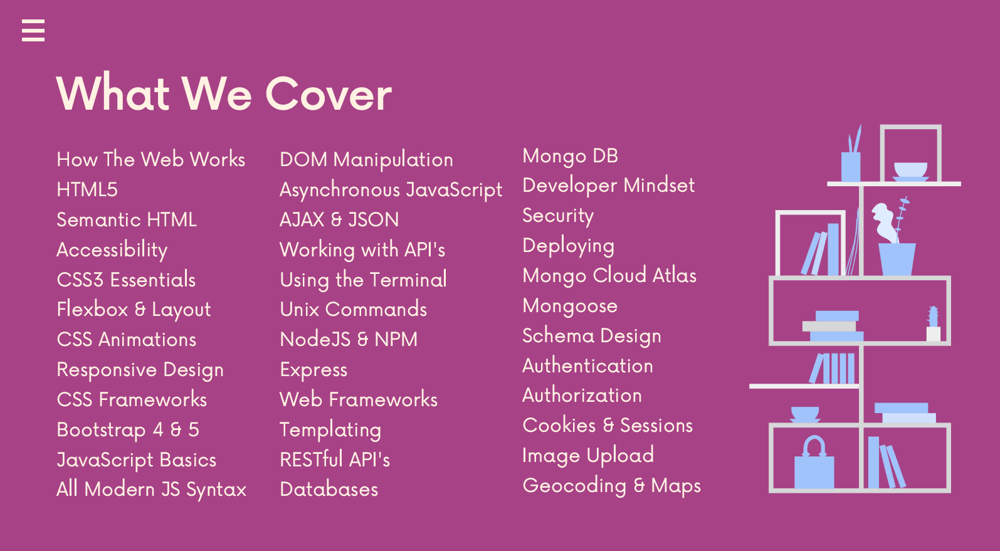

# Web Developer Bootcamp 2026
This repository documents my progress through [The Web Developer Bootcamp 2026 by Colt Steele](https://www.udemy.com/course/the-web-developer-bootcamp/) on Udemy, my main learning path for full-stack web development.  
It includes my course notes, exercises, challenges, and projects.

## Technologies


## Contents
| **Section** | **Topic** | **Status** |
|:----------: | --------- | :--------: |
| 01 | Course Orientation | ✅ |
| 02 | [An Introduction to Web Development](Sections/Section-02/README.md) | ✅ |
| 03 | [HTML: The Essentials](Sections/Section-03/README.md) | ✅ |
| 04 | [HTML: Next Steps & Semantics](Sections/Section-04/README.md) | ✅ |
| 05 | [HTML: Forms & Tables](Sections/Section-05/README.md) | ✅ |
| 06 | [CSS: The Very Basics](Sections/Section-06/README.md) |  |
| 07 | [The World of CSS Selectors](Sections/Section-07/README.md) |  |
| ... | ... | ... |

## 📁 Folder Structure
```
```
