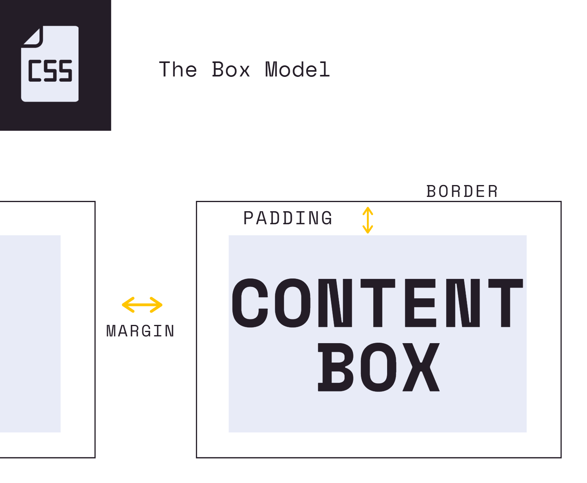
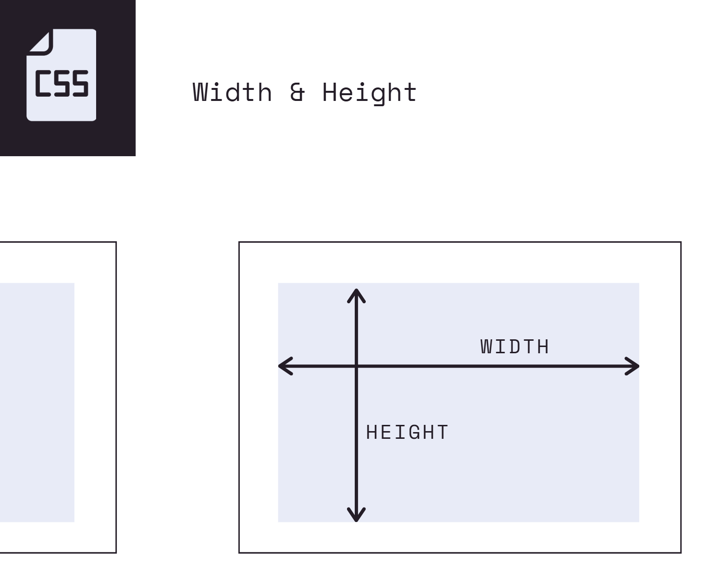

# Section 8 - The CSS Box Model

## Notes

### Box Model
###### The CSS box model describes how every HTML element is represented as a rectangular box. Each box consists of content, padding, border, and margin.
---




### Box Model: Width & Height
###### The width CSS property sets an element's width, while the height CSS property sets an element's height. By default, both apply to the content area. If `box-sizing: border-box` is used, the width and height include the content, padding, and border.
```css
div {
    width: 200px;
    height: 200px;
    background-color: #e5989b;
    /* The background color goes inside the content area, not all the way across the page */
}
```
---

### Box Model: Border & Border Radius
###### The border is the line around an element that surrounds the content and padding and separates them from the outside.

#### Border Properties
- `border-width` - Controls the thickness of the border.
- `border-color` - Controls the ...color of the border.
- `border-style` - Controls the line style - dashed, solid, etc.
- `border-radius` - Controls the roundness of an element's corners.  
**Note:** `border-radius: 50%` can make a square element into a circle.

```css
#one {
    background-color: #e5989b;
    width: 200px;
    height: 200px;

    /* ================================================== */
    border-width: 5px;
    border-color: black;
    border-style: solid;

    /* Alternative: Set all border properties in one line */
    border: 5px solid black;
    /* ================================================== */

    border-radius: 10px;

    /* Before this line, our box was 210x210 */
    box-sizing: border-box;
    /* After this line, it becomes 200x200 because the border is included in the element's width and height */
}
```
**Note:**  You can specify a border property for a specific side by adding `-top`, `-right`, `-bottom`, or `-left`. For example: `border-left-color` or `border-right-style`.

---

### Box Model: Padding
###### Padding is the space between an element's content and its border.

#### Individual Properties
- `padding-left`, `padding-right`, `padding-bottom`, `padding-top`
#### Shorthand Properties
- `padding: 10px;` - Apply to all four sides
- `padding: 5px 10px;`- vertical | horizontal → top & bottom | left & right
- `padding: 1px 2px 2px;`- top | horizontal | bottom → top | left & right | bottom
- `padding: 5px 1px 0 2px;`- top | right | bottom | left

```css
h1 {
    background-color: pink;
    width: 100px;
    padding-left: 100px;
    padding-top: 50px;
}
```
---

### Box Model: Margin
###### Margin is the space outside an element's border, between the element and other elements.
**Note:** We have individual and shorthand properties here as well, and they work the same way as the padding properties.

```css
body {
    margin: 0; /* By default, the body of our page has some margin */
}
```
---

### Display Property
###### The `display` property specifies how an element is displayed and how it participates in the layout of a page. Common values:

- #### `inline`
    Width & height are ingored. Margin & padding push elements away horizontally but not vertically.
- #### `block`
    Block elements start on a new line and, by default, take up the available width. Width, height, margin, and padding are respected.
- #### `inline-block`
    Behaved like an inline element except width, height, margin & padding are respected.
- #### `none`
    The element is not displayed and does not take up any space in the layout.

```html
<h1>I am h1</h1>
<h1>I am also h1</h1>  
<!-- By default, these are block-level elements -->
```
```css
h1 {
    background-color: palegoldenrod;
    border: 1px solid black;
    /* The element extends across the available width by default. We can change this using the display property. */
    display: inline;
} 
```

Inline-block Example
```css
/* In HTML, we have 3 empty divs */

div {
    height: 200px;
    width: 200px;
    background-color: olivedrab;
    border: 5px solid black;
    display: inline-block;
    margin: 20px;
    /* With inline-block, the elements can appear on the same line while keeping the width, height, margin and padding we set. */
}
```
---

### Relative Units: Percentages, EMS & REMS
- #### Percentages
    Percentages are always relative to another value. Depending on the property, that value can come from the parent element or from the element itself.
    - `width: 50%` - 50% of the width of the parent element.
    - `line-height: 50%` - 50% of the element's font size.  

    ```html
    <h1>CSS Units</h1>
    <section>
        <div></div>
    </section>
    ```
    ```css
    section {
        background-color: #6d6875;
        width: 800px;
        height: 800px;
    }

    div{
        background-color: #e5989b;
        width: 50%;
        height: 50;
        /* It becomes 1/4 of the section's area. Its width and height are relative to the section, its parent element. */
    }

    h1{
        font-size: 40px;
        border: 1px solid black;
        line-height: 200%; /* 200% of the font size for this element */
    }
    ```
- #### EMS
    - With `font-size`, `1em` equals the font-size of the parent element.
    - With other properties (like `padding` or `margin`), `1em`equals the computed font size of the element itself.  

    ```html
    <article>
        <h2>I am h2</h2>
        <button>Click Me</button>
    </article>
    ```
    ```css
    article {
        font-size: 30px;
    }

    h2 {
        font-size: 2em;  /* font-size: 2em = 2 × 30px = 60px */
        margin-left: 1em;  /* margin-left: 1em = 1 × 60px = 60px */
    }

    button {
        font-size: 1em;   /* 1em = the parent's font size = 30px */
        padding: 0 1em;  /* 1em = the button's computed font size = 30px */
        border-radius: 0.5em;  /* 0.5em = 0.5 × 30px = 15px */
        background-color: #2a9d8f;
        color: white;
    } 
    /* Using em units allows the button's font size to scale relative to its parent, while its padding and border radius scale relative to its font size. */
    ```
    **Note:** Avoid using `em` units for deeply nested elements because they compound relative to the parent element's font size, which can cause the text to become unexpectedly large or small.

- #### REMS
    Relative to the root **html** element's font-size. Often easier to work with.

    ```html
    <!DOCTYPE html>
    <html lang="en">  <!-- here -->
    <head>
        <meta charset="UTF-8">
        <meta name="viewport" content="width=device-width, initial-scale=1.0">
        <title>Document</title>
    </head>
    <body>
        <article>
            <h2>I am h2<h2>
            <h3>I am h3<h3>
            <button>Click Me</button>
        <article>
    </body>
    </html>
    ```
    ```css
    html {
        font-size: 10px;  /* The default font-size can be changed */
    }

    h2 {
        font-size: 3rem;  /* 3 × 10px = 30px */
    }

    h3 {
        font-size: 2rem;  /* 2 × 10px = 20px */
    }

    button {
        font-size: 1.5rem;  /* 1.5 × 10px = 15px */
        padding: 0 1em;  /* 1em = the button's computed font size = 15px */
        border-radius: 0.5em;  /* 0.5em = 0.5 × 15px = 7.5px */
        background-color: #2a9d8f;
        color: white;
        /* Sometimes it's useful to mix ems and rems, like in the example above */
    }

    /* Now we have a scale we can use across the document */
    ```
---

